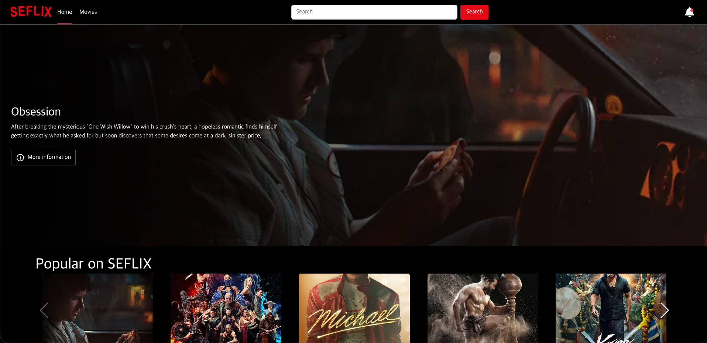
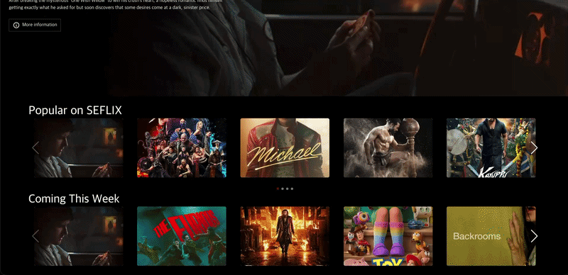
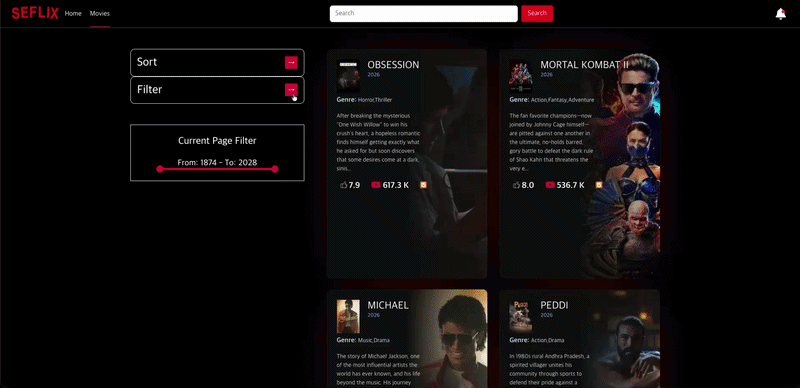
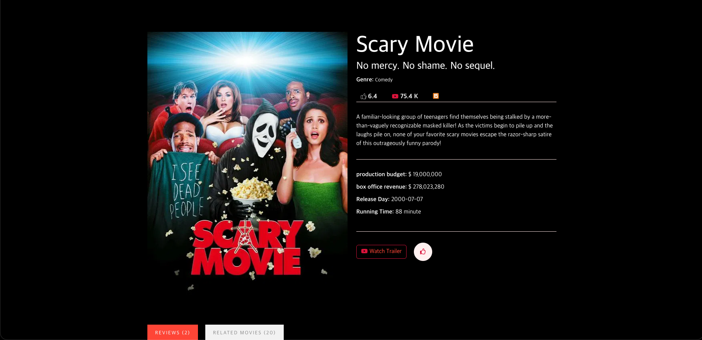
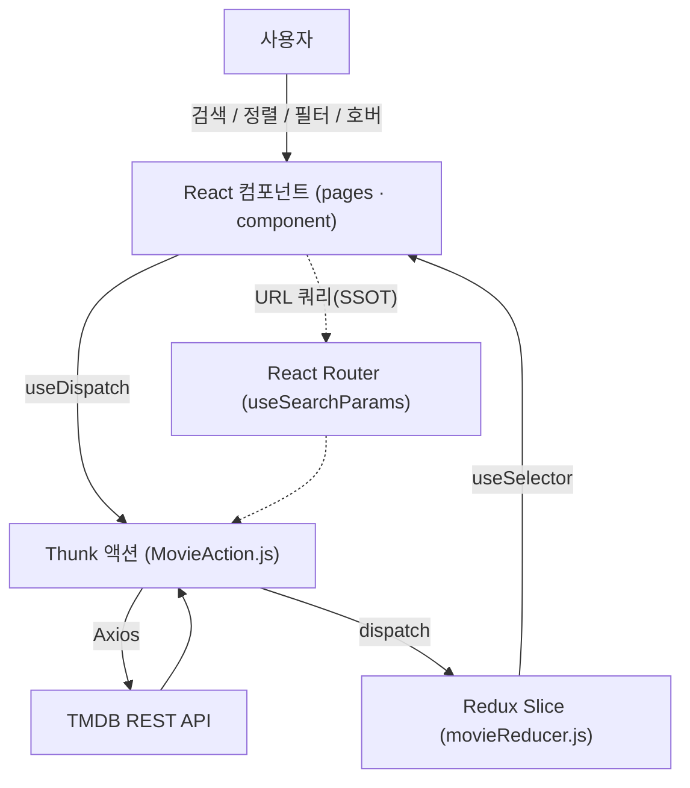
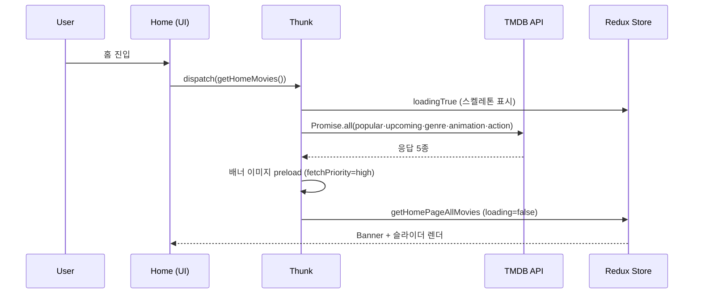

# 🎬 SEFLIX — Netflix Clone


**TMDB 데이터를 "탐색 → 미리보기 → 결정"의 흐름으로 압축한, 이미지 중심 영화 탐색 SPA입니다.**

이 프로젝트는 화면을 그대로 베끼는 데서 끝내지 않고, **OTT 서비스가 실제로 부딪히는 문제**
— 첫 화면 로딩 속도(LCP), 이미지 전송량, 공유 가능한 탐색 상태, 호버 미리보기 UX —
를 직접 정의하고 코드로 푸는 데 초점을 맞췄습니다. 핵심은 "정보를 보여주는 것"이 아니라
**체감 속도와 사용자 경험을 의식한 의사결정**입니다.

### 🔗 Links

- **Live Demo**: https://seflix.vercel.app
- **Repository**: https://github.com/byeonsejun/netflix

---

## 목차

1. [프로젝트 소개](#1-프로젝트-소개)
2. [기술 스택 및 도입 배경](#2-기술-스택-및-도입-배경-tech--why)
3. [아키텍처 및 폴더 구조](#3-아키텍처-및-폴더-구조)
4. [🔥 핵심 트러블슈팅 및 기술적 고민](#4--핵심-트러블슈팅-및-기술적-고민)
5. [📊 측정 지표](#5--측정-지표-measured-metrics)
6. [실행 방법](#6-실행-방법)
7. [향후 계획](#7-향후-계획)

---

## 1) 프로젝트 소개

| 화면             | 설명                                                                                    |
| ---------------- | --------------------------------------------------------------------------------------- |
| **Home**         | 히어로 배너 + 카테고리별 가로 슬라이더(Popular / Coming This Week / Animation / Action) |
| **Movies**       | 정렬·장르·개봉연도 필터 + 검색 + 페이지네이션을 갖춘 영화 목록                          |
| **Movie Detail** | 상세 정보·예산/수익·예고편 모달·리뷰·추천작 탭, 찜(좋아요)                              |

**주요 기능**

- 🎬 카드 **호버 후 3초 뒤 예고편 자동 재생** — Netflix 미리보기 UX 재현
- 🔍 검색 / 8종 정렬 / 장르 필터 / **현재 페이지 내 개봉연도 범위 필터**
- 🔔 상단 벨 아이콘 — 개봉 예정작 "What's New" 팝업
- 👍 찜하기 — `localStorage` 영속화
- 🔗 모든 탐색 상태를 **URL 쿼리로 직렬화** → 새로고침·뒤로가기·링크 공유에도 그대로 복원

### 📸 스크린샷

> 아래 경로(`docs/images/`)에 캡처/움짤 파일을 넣으면 바로 표시됩니다.

| 홈 (배너 + 슬라이더) | 카드 호버 미리보기 |
| :---: | :---: |
|  |  |
| **Movies (정렬·장르·연도 필터)** | **상세 페이지** |
|  |  |

```text
docs/images/
├─ 01-home.png            # 홈 배너 + 카테고리 슬라이더
├─ 02-hover-preview.gif   # 카드 호버 → 3초 뒤 트레일러 자동재생 (핵심 UX)
├─ 03-movies-filter.gif   # 정렬 / 장르 / 개봉연도 필터 동작
└─ 04-detail.png          # 상세 · 예고편 모달 · 리뷰/추천 탭
```

---

## 2) 기술 스택 및 도입 배경 (Tech & Why)

- **React 18 + Create React App**
  컴포넌트 단위로 화면을 분리하고, 라우트 단위 코드 스플리팅으로 초기 번들을 관리하기 위해 채택.
- **React Router v6 (`createBrowserRouter` 데이터 라우터)**
  중첩 라우팅과 `errorElement` 기반 에러 경계를 선언적으로 구성하고, 페이지를 `lazy`/`Suspense`로 분리하기 위해 도입.
- **Redux Toolkit + Thunk**
  지도/배너/필터처럼 여러 화면이 공유하는 영화 상태를 보일러플레이트 최소화로 다루고, 비동기 로직(`loading → 성공/실패`)을 컴포넌트 밖 Thunk로 분리하기 위해 선택.
- **Axios (인스턴스 + 인터셉터)**
  TMDB 베이스 URL/헤더를 한 곳에 고정하고, 요청·응답 인터셉터로 공통 에러 처리 지점을 확보.
- **Swiper**
  데스크톱~모바일까지 14단계 브레이크포인트로 `slidesPerView`를 세분화한 반응형 캐러셀을 구현하기 위해 도입.
- **react-youtube + React Portal**
  예고편 재생을 부모의 `overflow`/`z-index`에서 독립된 모달 레이어로 띄우기 위해 `createPortal`과 함께 사용.
- **React-Bootstrap**
  Pagination·Dropdown·Tabs 등 검증된 UI 프리미티브로 개발 속도를 확보.

---

## 3) 아키텍처 및 폴더 구조

### 🧩 구성도



### 🔄 홈 진입 데이터 시퀀스



### 📁 폴더 구조

```text
src/
├─ index.js                 # 데이터 라우터 정의 + 라우트 단위 코드 스플리팅(lazy/Suspense)
├─ App.jsx                  # Provider · Navigation · Outlet · 모달 portal 노드
├─ pages/
│  ├─ Home.jsx              # 히어로 배너 + 스켈레톤 + LazySection 슬라이더
│  ├─ Movies.jsx            # URL 쿼리 기반 목록/검색/정렬/필터/페이지네이션
│  └─ MovieDetail.jsx       # 상세 · 예고편 모달 · 리뷰/추천 탭 · 찜
├─ component/
│  ├─ Banner.jsx            # LCP 우선 이미지 처리
│  ├─ MovieSlide.jsx        # Swiper 반응형 캐러셀(브레이크포인트 세분화)
│  ├─ MovieCard.jsx         # 호버 미리보기(3s) + portal 모달
│  ├─ LazySection.jsx       # IntersectionObserver 지연 렌더
│  ├─ FilterCard · SortSlector · FilterSlector · ...
│  └─ ui/ModalPortal.jsx    # createPortal 래퍼
├─ redux/
│  ├─ store.js
│  ├─ api.js                # Axios 인스턴스 + 인터셉터
│  ├─ actions/MovieAction.js     # Thunk 비동기 액션 모음
│  └─ reducers/movieReducer.js   # createSlice (nowContent / originalContent 분리)
└─ util/
   ├─ tmdbImage.js          # 반응형 이미지 URL·srcSet 빌더 + 프록시 확장 지점
   └─ util.js               # localStorage 헬퍼, 벨 팝업 토글
```

### 설계 포인트

- **UI vs 데이터 로직 분리** — `component`는 표현/인터랙션에 집중하고, 데이터 가공·흐름 제어는 Thunk(`MovieAction.js`)와 `util/*`이 담당.
- **상태 단일화** — 배너·필터·검색·찜 등 화면을 가로지르는 상태를 `movie` 슬라이스에서 도메인 단위로 구획화.
- **URL = 단일 진실 공급원(SSOT)** — 탐색 상태를 컴포넌트 state가 아닌 URL 쿼리에 저장해 새로고침/공유에도 복원 가능.
- **이미지 유틸 캡슐화** — 모든 TMDB 이미지 URL 생성을 `tmdbImage.js` 한 곳으로 모아, 이후 이미지 프록시(WebP/AVIF) 전환을 `.env` 한 줄로 가능하게 설계.

---

## 4) 🔥 핵심 트러블슈팅 및 기술적 고민

> 아래는 코드에 실제로 반영된 의사결정들입니다. "왜 이렇게 짰는가"를 Situation–Cause–Solution으로 정리했습니다.

### 4-1) 히어로 배너가 LCP인데 늦게 떠서 첫인상이 느림

**Situation** — 영화 서비스의 첫 화면은 큰 배너 이미지가 LCP(최대 콘텐츠 페인트) 요소인데, 빈 화면이 오래 보임.
**Cause** — 배너 이미지가 데이터 응답 → React 렌더 시점에야 요청되고, 다른 리소스와 우선순위 경쟁에서 밀림.
**Solution** — `src/redux/actions/MovieAction.js`, `src/component/Banner.jsx`

- 홈 데이터 응답이 오는 즉시 배너 이미지를 `<link rel="preload" as="image" fetchPriority="high">`로 **선(先) 프리로드**.
- 배너 ``에 `fetchPriority="high"` + `loading="eager"`를 명시해 브라우저 우선순위 상향.
- 데이터 도착 전엔 **스켈레톤 UI**(`BannerSkeleton`)로 빈 화면·레이아웃 점프(CLS) 방지.

```js
function preloadBannerImage(backdropPath) {
  if (!backdropPath || document.getElementById('banner-preload')) return;
  const link = document.createElement('link');
  link.rel = 'preload';
  link.as = 'image';
  link.href = `https://image.tmdb.org/t/p/${BANNER_SIZE}${backdropPath}`;
  link.fetchPriority = 'high';
  document.head.appendChild(link);
}
```

### 4-2) 모바일에서 이미지 전송량이 과도하게 큼

**Situation** — TMDB `original`을 쓰면 카드 한 장도 수백 KB라, 슬라이더 수십 장이 깔리는 화면에서 페이로드가 폭증.
**Cause** — 모든 화면(배너/카드/썸네일)이 동일한 원본 해상도를 사용.
**Solution** — `src/util/tmdbImage.js`

- 용도별 적정 해상도를 상수로 정의(`TMDB_SIZE`: `w200`~`w1280`)하고, `srcSet` 빌더로 브라우저가 뷰포트에 맞는 크기를 고르게 함.
- 모바일 슬라이더 카드는 `w154`/`w300`으로 분기 → 카드 한 장당 약 **80~110KB 절감**(추정).
- 이미지 URL 생성을 한 모듈로 캡슐화해, 추후 `REACT_APP_IMAGE_PROXY` 한 줄만 설정하면 전 이미지가 프록시(WebP/AVIF)를 거치도록 확장 지점을 마련.

### 4-3) 홈 진입 시 화면 밖 슬라이더까지 한꺼번에 렌더/요청됨

**Situation** — 홈에 카테고리 슬라이더가 여러 개라, 진입 즉시 모든 이미지가 요청되며 초기 비용이 몰림.
**Cause** — 화면 밖 콘텐츠도 마운트 시점에 곧바로 렌더됨.
**Solution** — `src/component/LazySection.jsx`

- `IntersectionObserver`로 뷰포트 진입 직전(`rootMargin: 200px`)에야 하위 슬라이더를 마운트해 초기 렌더 비용·요청을 분산.
- 진입 전엔 `minHeight`로 영역을 예약해 스크롤 점프 방지.

### 4-4) 카드 호버 시 예고편 모달이 동시에 여러 개 뜸

**Situation** — 여러 카드에 빠르게 마우스를 옮기면 트레일러 모달이 중복으로 열림.
**Cause** — 카드마다 독립적으로 모달을 관리하는데, 비동기 영상 응답의 도착 순서가 보장되지 않음.
**Solution** — `src/component/MovieCard.jsx`

- 호버한 카드마다 **UUID**를 부여하고, Redux의 `globalModalId`와 **일치하는 카드에서만** 모달을 오픈.
- 호버 후 `setTimeout`(3초)으로 예고편을 요청하고, 벗어나면 `clearTimeout` → 스쳐 지나가는 호버는 무시.
- 모달은 `createPortal`로 `#portal` 노드에 분리 렌더링.

```jsx
useEffect(() => {
  if (uid !== globalModalId || detailVideo.results.length === 0) return;
  setOpenModal(true); // 지금 요청한 그 카드에서만 오픈
}, [detailVideo]);
```

### 4-5) 개봉연도 필터를 바꿀 때마다 서버 재요청이 필요

**Situation** — 연도 범위 슬라이더를 조작할 때마다 API를 다시 부르면 불필요한 왕복과 지연 발생.
**Cause** — 화면 표시용 데이터만 들고 있으면 원본을 잃어 클라이언트 필터링이 불가능.
**Solution** — `src/redux/reducers/movieReducer.js`, `src/component/FilterSlector.jsx`

- 리듀서에 `originalContent`(원본)와 `nowContent`(표시용)를 **분리 저장**.
- 슬라이더 조작 시 `originalContent`를 기준으로 연도 필터링한 결과만 `nowContent`로 갈아끼움 → **네트워크 왕복 없는 즉시 반영**.

### 4-6) 새로고침/공유 시 검색·필터·페이지 상태가 사라짐

**Situation** — 탐색 상태가 컴포넌트 state에만 있으면 새로고침·뒤로가기·링크 공유에서 손실됨(OTT의 딥링크 요구).
**Cause** — UI 상태와 URL이 동기화되지 않음.
**Solution** — `src/pages/Movies.jsx`

- 검색·정렬·장르·페이지를 모두 **URL 쿼리로 직렬화**하고 `useSearchParams`로 읽어 `switch (true)`로 분기.
- `f`/`gF` 보조 플래그로 "새 검색·필터 시작"을 구분해 페이지를 1로 리셋하는 등 엣지 케이스를 명시 처리.

```
/movies?s=batman&p=2                       → 검색
/movies?t=vote_count.desc&p=1              → 정렬
/movies?gT=popularity.desc&gN=28&p=3&gF=1  → 장르(액션)+정렬+페이지
```

### 4-7) TMDB 페이지네이션 상한을 넘는 요청

**Situation** — 페이지 번호를 무한정 노출하면 TMDB가 허용하지 않는 페이지를 요청해 오류.
**Cause** — TMDB는 페이지를 **최대 500**까지만 제공하며 `total_pages` 경계도 존재.
**Solution** — `src/pages/Movies.jsx`

- 현재 페이지를 중심으로 First/Prev/…/Next/Last를 동적으로 구성하되, **500 상한과 `total_pages` 경계**를 함께 계산해 잘못된 페이지 진입을 사전 차단.

---

## 5) 📊 측정 지표 (Measured Metrics)

측정 대상: **https://seflix.vercel.app/** (실제 프로덕션 배포 URL)
측정 환경: Lighthouse 13.2.0 · Emulated Desktop · Custom throttling · Chromium 149
측정 일시: **2026-06-17**

### Lighthouse 카테고리 점수

| Performance | Accessibility | Best Practices | SEO |
| :---: | :---: | :---: | :---: |
| **93** | **98** | **100** | **100** |

### Core Web Vitals & 로딩 지표

| 지표 | 측정값 | Google 기준(Good) | 판정 |
| --- | :---: | :---: | :---: |
| **LCP** (Largest Contentful Paint) | **1.6 s** | ≤ 2.5 s | ✅ Good |
| **FCP** (First Contentful Paint) | **0.3 s** | ≤ 1.8 s | ✅ Good |
| **TBT** (Total Blocking Time) | **0 ms** | ≤ 200 ms | ✅ Good |
| **CLS** (Cumulative Layout Shift) | **0** | ≤ 0.1 | ✅ Good |
| **Speed Index** | **1.4 s** | ≤ 3.4 s | ✅ Good |

> 배너 preload·`fetchPriority` 적용으로 **LCP 1.6s**, 스켈레톤 UI·이미지 크기 명시로 **CLS 0**,
> 라우트 코드 스플리팅·지연 렌더로 **TBT 0ms** 를 달성했습니다. 4개 Core Web Vitals가 모두 Good 구간입니다.

> 재현 방법: 크롬 개발자도구 → **Lighthouse** 탭 → *Analyze page load*,
> 또는 `npm run build` 후 `npx lighthouse <배포 URL> --view`.

---

## 6) 실행 방법

패키지 매니저: `npm` · 권장 Node: `>=16`

```bash
# 1) 의존성 설치
npm install

# 2) 환경 변수 — 루트에 .env 생성 (TMDB API Key 발급: https://www.themoviedb.org)
echo "REACT_APP_API_KEY=발급받은_TMDB_API_KEY" > .env
# (선택) 이미지 프록시 사용 시
# REACT_APP_IMAGE_PROXY=https://your-domain/api/image

# 3) 개발 서버
npm start          # http://localhost:3000

# 4) 프로덕션 빌드
npm run build
```

> ⚠️ TMDB API Key가 없으면 데이터가 로드되지 않습니다. `.env`는 `.gitignore`에 포함되어 커밋되지 않습니다.

**배포** — SPA 특성상 새로고침 시 클라이언트 라우트가 404가 되지 않도록 모든 경로를 `index.html`로 rewrite 합니다.

- **Vercel** — `vercel.json`의 rewrites
- **Netlify** — `netlify.toml`의 redirects(200)

---

## 7) 향후 계획

- **측정 자동화** — Lighthouse CI를 붙여 PR마다 성능 회귀를 감지.
- **이미지 프록시 적용** — 이미 마련해 둔 `REACT_APP_IMAGE_PROXY` 확장 지점을 통해 WebP/AVIF 변환을 실제 연결.
- **타입 안정성** — 외부 API 응답에 TypeScript + 런타임 스키마 검증을 도입.
- **테스트** — 유틸(`tmdbImage`)·리듀서·페이지네이션 경계 로직부터 단위 테스트로 회귀 방지.

---

### 이 프로젝트에서 보여주고자 한 것

- 화면을 "그리는" 수준을 넘어 **LCP·페이로드·코드 스플리팅 등 실제 서비스 성능 지표를 의식한 의사결정**
- **URL을 상태의 원천으로 삼는** 라우팅 설계와 공유 가능한 UX
- `originalContent` / `nowContent` 분리처럼 **재요청 없는 클라이언트 필터링**을 위한 상태 모델링
- 호버 미리보기·딥링크·찜 등 **OTT 도메인 특유의 UX**에 대한 이해
